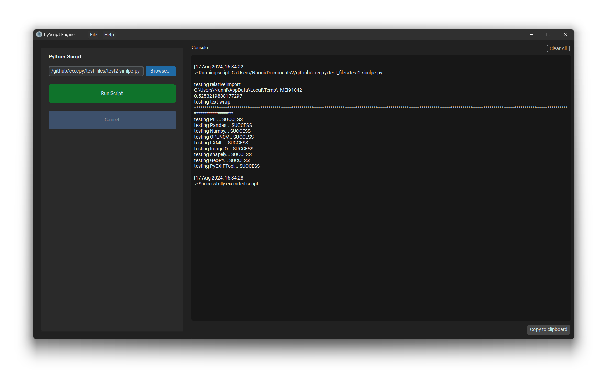

# PyScript Engine
A self-contained GUI application designed for executing Python scripts. It offers a seamless solution for running Python scripts without any prerequisites or external system dependencies, eliminating the need for Python installation.



## Usage
- Browse the python script to run and start running the script. as simple as it gets. 
- You have the ability to cancel the execution at any point.
- Additionally, there are options available to clear the console screen and copy the console output.

## Package Support
The packages included in the app are immutable, meaning no additional packages can be installed, modified, or removed. This requirement must be fulfilled prior to the build process. 
- Relative imports are supported.
- To see the list of avilable packages, go to `Help` on the menu and select `Package` option.

## For Developers
### Installation:
- Python 3.x to build app and becomes version that app uses to run scripts. 
- Create virtual enviroment and install dependencies through `requirements.txt`  

### Build:
Set env variable for TCL lib, add path from your system
Copied DLL and tcl8.6 in dependencies from miniconda  
```
$ set TCL_LIBRARY=<PATH-TO>\dependency\win64\tcl8.6
```
Run this on the system chosen according to the designated target system. For now only for Windows. Can build this on Windows VM as well. 
```
$ pyinstaller spec/pyscript-engine_1.0.0_win64.spec
```
Modify and run latest from `/spec` for configuring pyinstaller and build dependencies.

## Add Package
To add new packages, it should be installed and added in spec before build. Actual package should be given in spec file for pyinstaller to find all its dependencies.
Note: size and the initial loading time of executable will depend on the packages included.

## TODO
1. Add support for Linux and MacOS (less optimistic for MacOS)
2. Provide option to use user's local packages by adding path

## Rant/Help
Pyinstaller was pain to setup and make it working as desired. This might break in future if there is any upgrade of any kind. so write a test script which you intented to use.   
I understand, this is not optimal and there are too many dependencies to make this work right but if there is another alternative which enables to do the same with less pain, please help me.


## Credits
- [CustomTkinter](https://github.com/TomSchimansky/CustomTkinter)
- [CTkTable](https://github.com/Akascape/CTkTable), [CTkMenuBar](https://github.com/Akascape/CTkMenuBar) - [Akascape](https://github.com/Akascape)